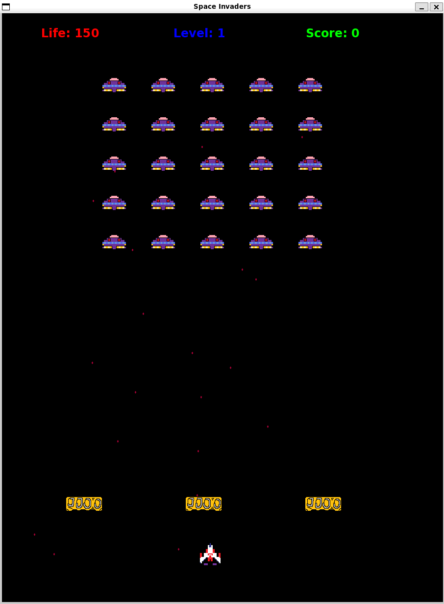

# Space Invaders

This is a simple Space Invaders game written in C++ using the SFML library, including possibility of saving to JSON.

- [Dependencies](#dependencies)
- [Screenshots](#screenshots)
- [Installing Dependencies](#installing-dependencies)
- [How to Play](#how-to-play)
- [UML Documentation](#uml-documentation)

# Dependencies

Before building and running the game, make sure you have the following dependencies installed:

- CMake (Minimum version 3.12)
- C++ Compiler (g++ or clang++)
- SFML Library (Minimum version 2.5)
- nlohmann/json (3.2.0)

# Screenshots

<div align="center">
  <h2>Main Menu</h2>
</div>


<div align="center">
  <h2>In-Game</h2>
</div>



<div align="center">
  <h2>Endgame Menu</h2>
</div>


## Installing Dependencies

For starter:
```bash
sudo apt-get update
```

#### CMake

Install CMake using the package manager for your system. On Debian-based systems, you can use:


```bash
apt-get install cmake
```

#### C++ Compiler

Make sure you have a C++ compiler installed. On Debian-based systems, you can install g++ with:

```bash
apt-get install g++
```

#### SFML Library

Install the SFML library. Below are the commands for Debian-based systems:

```bash
apt-get install libsfml-dev
```

#### JSON for Modern C++

Install nlohmann/json. To be able to save whole game in JSON file  

```bash
apt install nlohmann-json3-dev
```

# How to Play
- Move the player spaceship using the left and right arrow keys.
- Press the space bar to shoot bullets.
- Aim to shoot down the moving enemies.
- Press the P key to save whole game, to be able to resume to it later.

# UML Documentation

